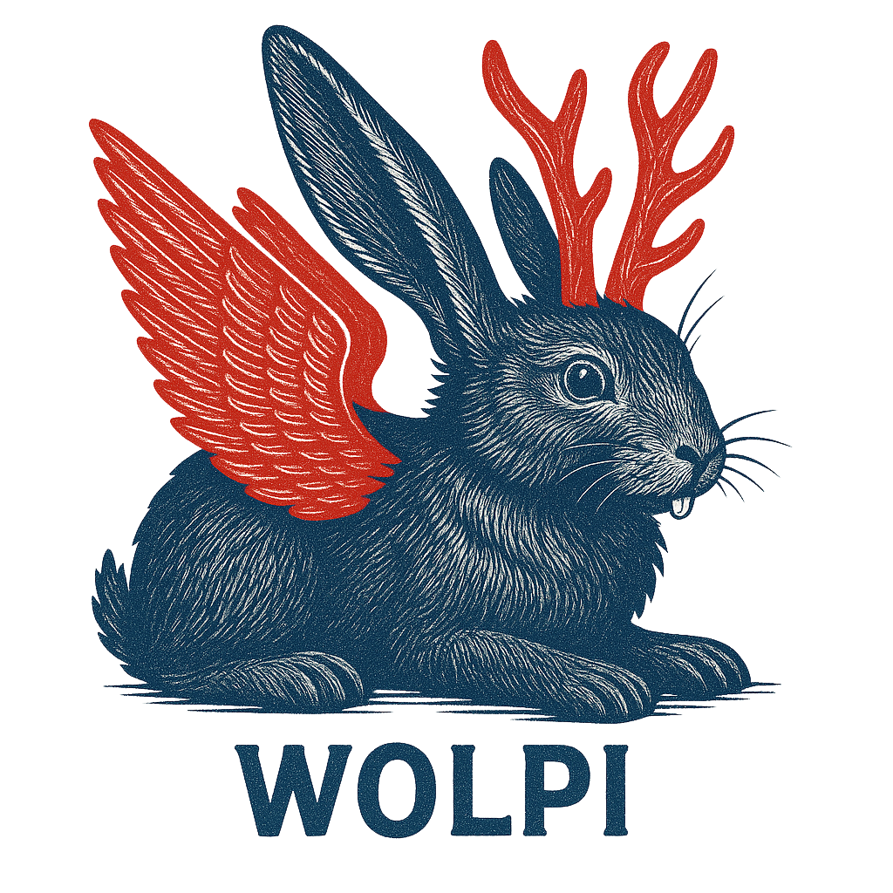

{width=50%}
# Wolpi: A fast and extensible IIIF Image Server

## Requirements
- `libvips` must be available on the system
- Java must be installed in at least version 24

## Quick Start

```sh
$ cp -R docs/img images
$ mvn spring-boot:run
# In a different shell
$ curl -v http://localhost:8080/v3/wolpi.png/info.json
```

You should be able to open http://localhost:8080/v3/wolpi.png/full/max/0/default.webp in your browser.


## Troubleshooting

- **Application fails to start due to missing vips shared library:** The `vips-ffm` bindings are pretty picky
  in terms of how they locate the shared library. If your shared library name is not ending on `.so`, it won't
  be found. You can either create a symlink to e.g. `/lib/x86_64-linux-gnu/libvips.so`, or you can invoke
  Wolpi with `-Dvipfsffm.libpath.vips.override=/lib/x86_64-linux-gnu/libvips.so.42`. You can find out where
  your vips library is located by invoking `ldd $(which vips) |grep libvips`.