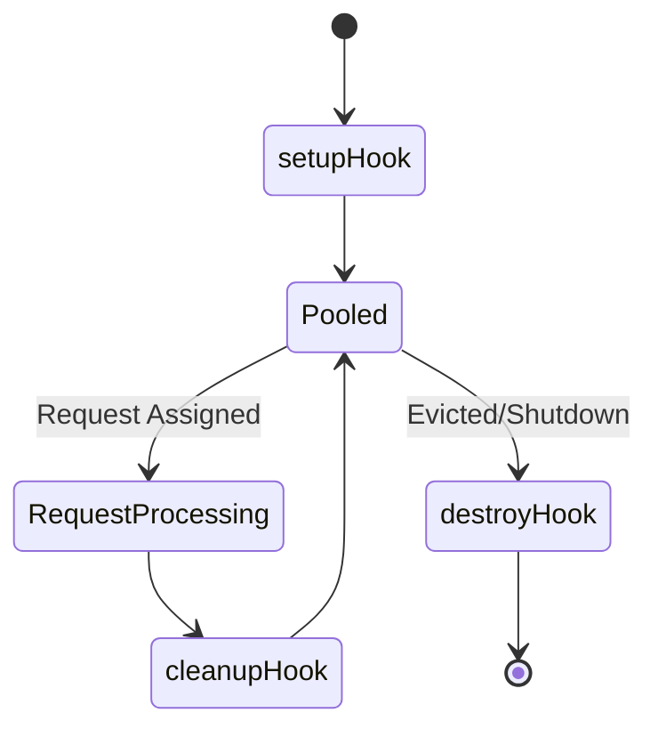
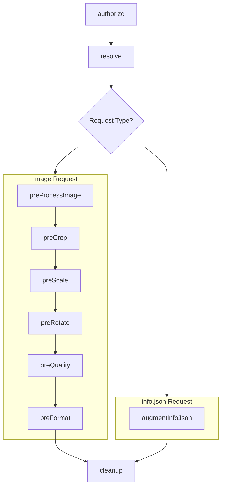

# Extension Execution Model

## Extension Pooling and Lifecycle
Extensions in Wolpi are kept in a pool after they have been loaded, so that they can be reused for
multiple subsequent requests without having to run expensive initialization code for each request.
Wolpi ensures that **only one request is processed by any one extension instance at a time**, so that
extensions do not need to worry about concurrency issues and can keep state in memory between
hook invocations and requests without having to secure it with locks or other synchronization
mechanisms. Each pooled extension instance runs [`setup`](../extension-development.md#setup-and-destroy-hooks) once when the
instance is created, [`cleanup`](../extension-development.md#cleanup-hook) after each request it participated in, and
[`destroy`](../extension-development.md#setup-and-destroy-hooks) when that instance is evicted from the pool or otherwise shut
down.

## Extension Request Processing
Wolpi extensions work by implementing one or more "hooks". A hook is a function that is called by
Wolpi at a specific point in its request processing pipeline. Most of the hooks are called when
processing client requests, where they can implement custom [authorization](../extension-development.md#authorize-hook),
[resolving](../extension-development.md#resolve-hook) or [override steps in the image processing](../extension-development.md#image-processing-hooks).
There's also a [hook for implementing customizations to the `info.json` response](../extension-development.md#info-hook).
If multiple extensions implement the same hook, the behavior depends on the hook
and is described [in the extension development documentation](../extension-development.md#multiple-extensions-and-hook-behavior).

During request handling, developers can safely assume that the request hooks are called in a
specific order:

This means that you can maintain state between hook invocations and be sure that the state
will always refer to the same request, as long as you clean it up in the end:
Wolpi **requires** that every extension implements a [cleanup](../extension-development.md#cleanup-hook) hook. It is called after request
processing for an extension instance that participated in handling the request. Use this hook to
clear up any state that should not persist between requests. It's perfectly fine to have the hook do
nothing if your extension does not accumulate any request-scoped state, but we mandate it anyway to
avoid accidental state leaks (which are really difficult to debug).

## Multiple Extensions and Hook Behavior

When configuring multiple extensions, it can happen that more than one extension implements
the same hook. What happens in this case depends on the hook:

- **`authorize`**
    Called **in parallel** until one returns `false`, in which case the request is
    considered unauthorized and all other pending hook calls are canceled. If all return `true`,
    the request is authorized. If any of the extensions throws an error, the request fails with a
    error response.
- **`resolve`**
    Called **in parallel** until one resolves to a valid image source, in which case all other
    pending hook calls are canceled. If none of the extensions resolve the identifier, Wolpi falls back
    to resolving it against the configured filesystem image base directory. If that also fails, the
    request fails with a `404 Not Found` error. If any of the extensions throws an error and none of the
    others can resolve the identifier, the request fails with an error response, otherwise the error is
    logged and the first successful resolution is used.

!!! warning "Order is not guaranteed!"

    Since the `authorize` and `resolve` hooks are called in parallel, there is no guarantee
    about the order in which the extensions are called. If you have multiple extensions that
    implement these hooks, ensure that they do not depend on being called in a specific order and
    ideally that there is no overlap in the identifiers they can handle.
    If you need ordered behavior, e.g. to implement a custom "fallback resolver", consider combining
    the logic into a single extension by declaring the other extensions as dependencies in your own
    extension package, assuming they share a programming language.

- **`augmentInfoJson`** and **`preProcessImage`**
    Called in sequence, passing the result of each hook as the input to the next one. If any of them
    throw an error, the request fails with an error response.

- **`preCrop`**, **`preScale`**, **`preRotate`**, **`preQuality`**, **`preFormat`**
    Called in sequence until one returns a non-null result. If none returns a non-null result,
    the standard implementation for that operation is used. If any of them throw an error,
    the request fails with an error response.