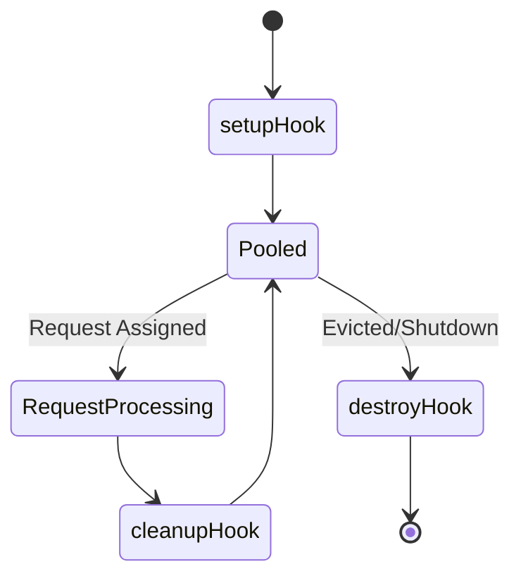
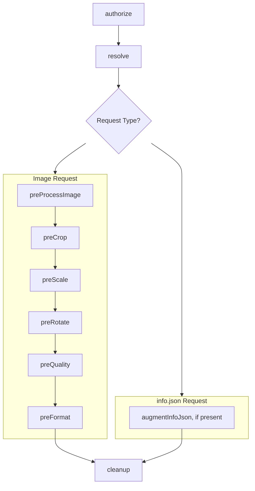

# Extension Execution Model

When a user defines an extension in their configuration, Wolpi will first install it to its data
directory, if necessary (i.e. for everything but local single-file extensions). It will then load
it, load its metadata from the [`info` hook][info-hook] and verify it using
the [IIIF Image API Validation test suite][iiif-validation].

[info-hook]: ../extension-development.md#info-hook
[iiif-validation]: https://github.com/dbmdz/image-validator-ng
[cleanup-hook]: ../extension-development.md#cleanup-hook

## Extension Pooling and Lifecycle

While running, Wolpi keeps loaded extension instances in a pool, so the expensive extension setup
and language runtime initialization is not run on every request, and instead reused across many
requests.

When Wolpi receives a request, it will **borrow** an instance of the extension from this shared
pool, execute the hook and then **return** it back to the pool, after which it can be re-used
by other requests.

A borrowed instance handles **one request at a time**. An extension can keep request-scoped state in
memory between hook calls without adding synchronization around that state. The extension must clear
state in [`cleanup`][cleanup-hook] if the next request is not supposed to see it.

Each pooled extension instance runs:

- [`setup`](../extension-development.md#setup-and-destroy-hooks) once, when Wolpi creates the
  instance.
- [`cleanup`](../extension-development.md#cleanup-hook) after each request in which the instance
  participated.
- [`destroy`](../extension-development.md#setup-and-destroy-hooks) when Wolpi evicts the instance
  from the pool or shuts down.

## Extension Request Processing
Extensions participate in request handling through hooks:

- [authorization](../extension-development.md#authorize-hook)
- [identifier resolution](../extension-development.md#resolve-hook)
- [image processing](../extension-development.md#image-processing-hooks)
- [`info.json` customization](../extension-development.md#info-hook)

For one request, the hook order is:

An extension can read state set from an earlier hook, since all hooks on a request are executed on
the same borrowed instance. For example, it can resolve metadata once and reuse it during image
processing or `info.json` augmentation.

`cleanup` is the request boundary. Wolpi **requires** every extension to implement a
[cleanup](../extension-development.md#cleanup-hook) hook. A stateless extension can leave it empty.
An extension with request-scoped state should clear that state there.

## Multiple Extensions and Hook Behavior

When multiple extensions implement the same hook, Wolpi uses hook-specific rules:

- **`authorize`**
    Wolpi calls these hooks **in parallel** until one returns `false`. Wolpi then treats the request
    as unauthorized and cancels all pending hook calls. If all return `true`, Wolpi authorizes the
    request. If any extension throws an error, the request fails with an error response.
- **`resolve`**
    Wolpi calls these hooks **in parallel** until one resolves to a valid image source. Wolpi then
    cancels all pending hook calls. If no extension resolves the identifier, Wolpi falls back to the
    configured filesystem image base directory. If that also fails, the request fails with a
    `404 Not Found` error. If an extension throws an error and no other extension resolves the
    identifier, the request fails with an error response. If another extension resolves the
    identifier, Wolpi logs the error and uses the first successful resolution.

!!! warning "Parallel hooks have no order"

    Wolpi calls the `authorize` and `resolve` hooks in parallel, so extension order is undefined. If
    you have multiple extensions that implement these hooks, ensure that they do not depend on a
    specific order and avoid overlap in the identifiers they can handle.
    If you need ordered behavior, e.g. to implement a custom "fallback resolver", consider combining
    the logic into a single extension by declaring the other extensions as dependencies in your own
    extension package, assuming they share a programming language.

- **`augmentInfoJson`** and **`preProcessImage`**
    Wolpi calls these hooks in sequence. Each extension receives the previous extension's result. If
    any of them throw an error, the request fails with an error response.

- **`preCrop`**, **`preScale`**, **`preRotate`**, **`preQuality`**, **`preFormat`**
    Wolpi calls these hooks in sequence until one returns a non-null result. The returned value
    handles the stage, and Wolpi does not call later extensions for the same stage. If none returns a
    non-null result, Wolpi uses the standard implementation. If any of them throw an error, the
    request fails with an error response.

Image-processing hooks also constrain request planning. Wolpi uses reduced-size load and crop/scale
fast paths only when it knows that extensions do not need to intercept those stages. See
[Request and Image Processing Pipeline](./request-and-image-processing-pipeline.md).
