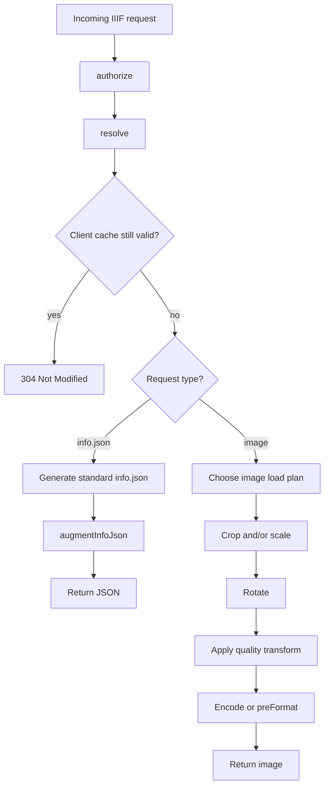

# Request and Image Processing Pipeline

IIIF defines the logical order for image requests: region, size, rotation, quality, format. Wolpi
must preserve the result of this sequence, but it does not execute those operations in that order,
since for very common thumbnail and tile requests, opening the source image at native size would
result in a lot of unnecessary work.

For each image request, Wolpi chooses:

- extension hooks to run
- crop/scale plan
- source load size

## Shared Request Path

Each request first goes through authorization, identifier resolution, and cache validation. If the
client has a fresh copy, Wolpi can return `304 Not Modified` before generating `info.json` or
decoding image data.

After that, the request splits:

- `info.json` requests generate the IIIF information response and pass it through `augmentInfoJson`
  when an extension provides that hook.
- Image requests choose an image load plan, build the libvips operation graph, and encode the
  response.

## Extension Hooks Decide Which Shortcuts Are Legal

Wolpi asks the extension runtime for `skippableHooks` before choosing the image path. A hook in that
set will not affect this request.

Wolpi combines hook declarations with the safest interpretation:

- Unimplemented hooks are skippable.
- With multiple extensions, a hook is skippable only if every extension can skip it.
- If a hook might run, Wolpi keeps the pipeline stage visible to extensions.

`preProcessImage`, `preCrop`, and `preScale` drive the early load decision. `preRotate`,
`preQuality`, and `preFormat` affect the response, but they do not decide whether Wolpi can avoid a
native-size image load.

## Crop and Scale Strategies

Wolpi records the chosen crop/scale strategy in metrics.

### `SCALE_NO_CROP`

Used for uncropped downscales when `preProcessImage` is skippable.

Uncropped requests have no crop stage to preserve, and no preprocessing hook needs native-size
pixels. Wolpi can ask the loader for the requested output size.

### `SCALE_THEN_CROP`

Used for cropped downscales when preprocessing, crop, and scale hooks are all skippable.

The IIIF operation remains crop-then-scale. The shortcut is physical: Wolpi loads a smaller
intermediate image, remaps the crop rectangle to that image, crops there, and performs any final
scale. For formats with cheap reduced whole-image loads, this avoids opening a large native-size
image before cropping.

An extension that needs `preCrop` or `preScale` prevents this strategy, because it may depend on the
original stage boundary.

### `CROP_THEN_SCALE`

Used when Wolpi must preserve all stage boundaries.

The order is:

1. `preProcessImage`, if needed
2. `preCrop`, or Wolpi's built-in crop
3. `preScale`, or Wolpi's built-in scale

`CROP_THEN_SCALE` preserves every extension and IIIF stage boundary. libvips can defer operation
evaluation, and some source formats support efficient region access.

## Image Loading

The crop/scale strategy records what Wolpi may do. The load type records how Wolpi opened the
source.

### Native Open

Wolpi opens the source at native size when it may need full-resolution pixels before it can continue.
Wolpi also uses native open for custom preprocessing and for cases where no reduced load applies.

### Thumbnail Loading

For many downscales, Wolpi uses [libvips' thumbnail APIs][vips-thumb] to load at the target size. In
metrics, Wolpi records this as `THUMBNAIL`.

[vips-thumb]: https://github.com/libvips/libvips/wiki/HOWTO----Image-shrinking

### Shrink-on-Load

Some sources advertise reduced-resolution sizes. If the requested target size matches one of them,
Wolpi can ask the loader for that representation instead of loading a larger image and resampling it.

In metrics, Wolpi records this as `SHRINK_ON_LOAD`.

Wolpi applies shrink-on-load to:

- JPEG 2000 images with multiple resolution levels
- TIFF images with resolution layers or pyramidal Sub-IFDs
- HEIF images with an embedded thumbnail

If the requested size does not match an available reduced size, Wolpi uses thumbnail loading.

## Later Stages

After crop and scale, Wolpi applies:

- `preRotate`, or built-in IIIF rotation
- `preQuality`, or built-in color, gray, or bitonal conversion
- `preFormat`, or built-in encoding for the requested output format

`preFormat` can replace Wolpi's encoder and return encoded bytes, a content type, and extra headers.

## Practical Consequences

- Pyramidal JPEG 2000 and TIFF sources are valuable when clients request the advertised sizes.
- Extensions should mark `preProcessImage`, `preCrop`, and `preScale` as skippable when they do not
  apply to a request.
- Hooks that may run for most requests force Wolpi to keep the corresponding pipeline stages visible,
  which can rule out reduced-size loads and crop/scale reordering.
