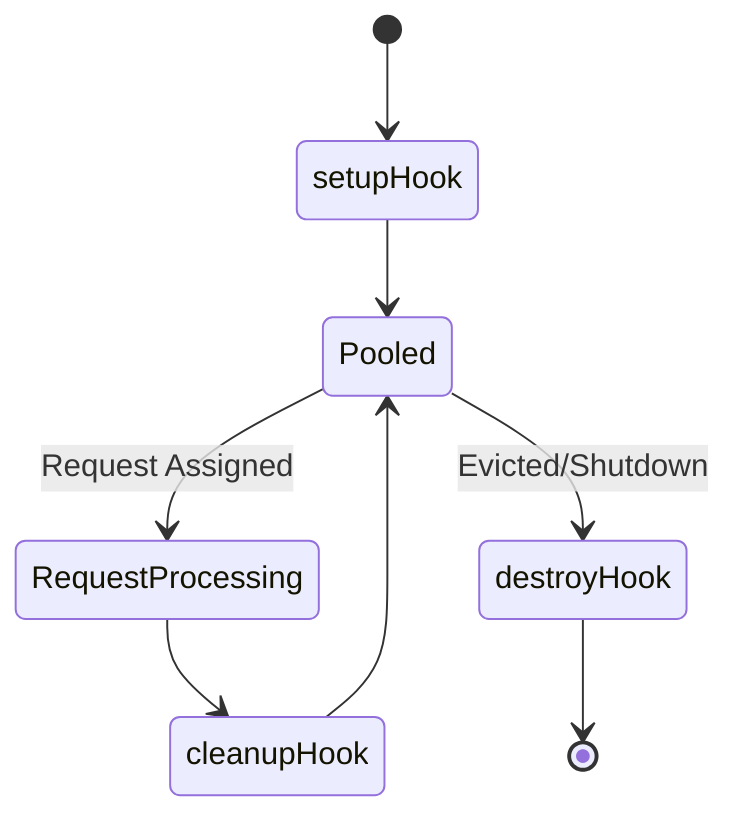
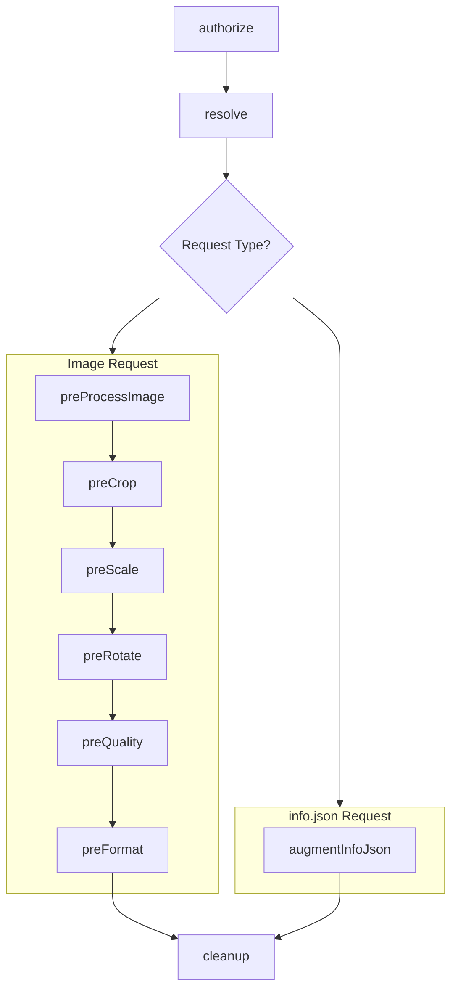

# Developing Extensions

Wolpi extensions are small programs that expose a set of [*hooks*][hooks] that Wolpi calls at specific points during its processing pipeline. By implementing these hooks, extensions can customize Wolpi's behavior in various ways.

Wolpi also provides a [`wolpi` context object][wolpi-context] that gives extensions access to the Wolpi context, including configuration, logging, metrics, and some utility functions. Extensions can use this object to interact with parts of the Wolpi runtime environment.

Extensions in Wolpi undergo a [specific lifecycle][lifecycle], from initialization to request processing to cleanup. Understanding this lifecycle is crucial for developing effective extensions that are performant and resource-efficient.

This page is organized so you can either read it from top to bottom or jump directly to the part you need:

- If you want to get an extension running quickly, start with [Quickstart](#quickstart) and [Development Setup](#development-setup).
- If you are deciding which hook to implement, go to [Hook Overview](#hook-overview).
- If you need the full signatures and behavior of each hook, use the [Hook Reference](#hook-reference).
- If you are looking for runtime facilities such as `wolpi`, logging, metrics or Java interop, see [Runtime APIs](#runtime-apis).
- If you are packaging extensions or choosing between JavaScript and Python, see [Choosing a Language](#choosing-a-language) and [Packaging and Project Layout](#packaging-and-project-layout).

[hooks]: #hook-reference
[wolpi-context]: #the-wolpi-object
[lifecycle]: #extension-lifecycle

## Quickstart

If you want to get a first extension running before diving into the full API, start with a single-file extension. For running Wolpi locally while developing, see [Development Setup](#development-setup).

Every extension needs to implement the [`info`](#info-hook) and [`cleanup`](#cleanup-hook) hooks, so you can start with a minimal implementation of those and then expand it from there. The following examples show the minimal structure of a single-file extension in JavaScript and Python, respectively, using a very simple [resolver](#resolve-hook) that resolves identifiers like `js-<name>` or `py-<name>` to `<name>.jpg` files in a configured directory.

=== "JavaScript"

    A single-file JavaScript extension is a single `.js` or `.mjs` file that exports its hooks.
    The default export can be a plain object or another object instance such as a class instance.

    ```javascript linenums="1" title="helloworld.js"
    export default {
      info: () => ({
        apiVersion: 1,
        name: 'hello-world',
        description: 'just a simple resolving proof-of-concept'
      }),
      cleanup: () => {
        // no cleanup needed, but method must be present
      },
      resolve: (identifier) => {
        if (!identifier.startsWith('js-')) {
          return;
        }
        // wolpi.config has the configuration object for this extension
        const { baseDirectory } = wolpi.config;
        return {
          path: `${baseDirectory}/${identifier.substring(3)}.jp2`
        }
      }
    }
    ```

=== "Python"

    A single-file Python extension can be as simple as a single `.py` file that defines its hooks as top-level functions.

    ```python linenums="1" title="helloworld.py"
    from pathlib import Path

    import wolpi

    IMAGE_EXTENSIONS = {'.jpg', '.jpeg', '.png', '.gif', '.jp2', '.tif', '.webp'}


    def info():
        return {
            'apiVersion': 1,
            'name': 'hello-world-py',
            'description': 'just a simple resolving proof-of-concept'
        }

    def cleanup():
        # no cleanup needed, but method must be present
        pass


    def resolve(identifier):
        if not identifier.startswith('py-'):
            return
        identifier = identifier[3:]
        base_dir = Path(wolpi.config["baseDirectory"])
        for path in base_dir.iterdir():
            if path.stem == identifier and path.suffix in IMAGE_EXTENSIONS:
                return {'path': str(path.absolute())}
    ```

    If you prefer to use a class for your extension, you can provide a `wolpi_extension` factory method
    that is called without arguments and should produce an instance of your extension:

    ```python linenums="1" title="helloworld-cls.py"
    import wolpi

    class MyExtension:
        # same hooks as above as instance methods
        ...

    def wolpi_extension():
        return MyExtension()
    ```

Configure the extension in your `wolpi.yml`:

```yaml
extensions:
  - path: /app/extensions/hello-world.js  # or hello-world.py
    config:
      baseDirectory: /images
```

Then launch the Wolpi container with the extensions, config and images directories mounted as volumes:

```bash
$ docker run \
    -p 8080:8080 \
    -v "$(pwd)/wolpi.yml:/app/wolpi.yml" \
    -v "$(pwd)/extensions:/app/extensions" \
    -v "$(pwd)/images:/images" \
    ghcr.io/dbmdz/wolpi:latest
```

Drop an image (like [this one](https://upload.wikimedia.org/wikipedia/commons/2/28/Wolpertinger.jpg) into the `images` directory with the name `test.jpg`, and you should be able to access its `info.json` via
- JavaScript: `http://localhost:8080/v3/js-test/info.json`
- Python: `http://localhost:8080/v3/py-test/info.json`

Once you have one of these examples loading, use the [Hook Overview](#hook-overview) and the [Hook Reference](#hook-reference) to expand it to your liking.

## Development Setup

We highly recommend using the official container image for developing extensions, since it already ships
with all the dependencies required to run Wolpi with Python/JavaScript extensions (including those with
third party dependencies). To do so, simply mount your configuration and the directory with your extensions
into the container:

```bash
$ docker run \
    -p 8080:8080 \
    -p 4711:4711 \ # (1)!
    -v "$(pwd)/wolpi.yml:/app/wolpi.yml" \ # (2)!
    -v "$(pwd)/extensions:/app/extensions" \
    ghcr.io/dbmdz/wolpi:latest
```

1.  For debugging, see [below](#debugging-extensions)
2.  You can customize the configuration path inside the container by setting the `WOLPI_CONFIG`
    environment variable, by default Wolpi will check `/app/wolpi.yml` or `/app/wolpi.yaml`

Your `wolpi.yml` should specify the extension under the `extensions` prefix:

```yaml
extensions:
- path: /app/extensions/hello-world.js
```

## Type Hints

Type hints provide IDE autocompletion and static type checking for extension code. We provide type hint packages for both JavaScript and Python.

=== "JavaScript"

    The [`wolpi-types`](https://github.com/dbmdz/wolpi-types-js) npm package ships TypeScript
    declaration files providing:

    - Wolpi hook signatures and data model types
    - declarations for the global `wolpi` object and GraalJS `Java` interop
    - typings for `wolpi:fs` and `wolpi:fetch`
    - opaque host object types used by the core API (`VImage`, `ByteBuffer`, `HttpClient`, `Arena`, etc.)

    The exported type names match the Java types used in Wolpi itself.

=== "Python"

    The [`wolpi-extension-api`](https://github.com/dbmdz/wolpi-types-py) package ships `.pyi`
    stub files covering all the values accessible via the `wolpi`, `wolpi.errors`, and
    `java` modules, as well as all types passed into or returned from the extension
    hooks.

    Inside Wolpi/GraalPy, the real `wolpi` and `java` modules are injected by the
    runtime; this package is for local type checking and editor support.

## Core Model

### Hooks

Wolpi extensions work by implementing one or more "hooks". A hook is a function that is called by
Wolpi at a specific point in its request processing pipeline. Most of the hooks are called when
processing client requests, where they can implement custom [authorization](#authorize-hook),
[resolving](#resolve-hook) or [override steps in the image processing](#image-processing-hooks).
There's also a [hook for implementing customizations to the `info.json` response](#info-hook).
If multiple extensions implement the same hook, the behavior depends on the hook
and is described [below](#multiple-extensions-and-hook-behavior).

### IIIF Compliance

Wolpi's Extension API allows customization of pretty much every aspect of the image processing pipeline.
With great power comes a bit of responsibility, though: Wolpi is designed to be a IIIF-compliant
image server, and **extensions must not violate the IIIF specification**. This means that extensions
must ensure that every part of the official IIIF Image API specification is adhered to, including
parameter parsing, behavior, and error handling. On startup, Wolpi validates configured extensions
against the official IIIF Image API test suite and refuses to start if validation fails. Validation
is performed per extension in isolation, and unchanged extensions may be skipped on later startups
if their cached validation result is still valid.

Practically, as an extension developer, this means:

- If possible, gate your custom logic behind syntax that does not conflict with IIIF syntax. For
    example, if you want to implement a custom cropping behavior, use a custom syntax that is not
    valid IIIF syntax (e.g., `customCrop:x,y,w,h` instead of `x,y,w,h`).
- In some cases you may want to implement custom behavior that replaces standard IIIF behavior
    (e.g., a custom scaling algorithm). In these cases, ensure that your implementation adheres
    to the IIIF specification in terms of parameter parsing, behavior, and error handling. You have
    access to a IIIF Image API parameter parser in the [Wolpi context](#the-wolpi-object) that you can use to ensure compliance with the specification.
- Run your extension against the IIIF Image API conformance tests to ensure compliance. You can
    do this with the `validate` subcommand of the Wolpi application:
    ```bash
    java -jar wolpi.jar validate path/to/your/extension
    ```
    You can add `-w` to automatically run the tests whenever the extension code changes.

### Extension Lifecycle

Extensions in Wolpi are kept in a pool after they have been loaded, so that they can be reused for
multiple subsequent requests without having to run expensive initialization code for each request.
Wolpi ensures that **only one request is processed by any one extension instance at a time**, so that
extensions do not need to worry about concurrency issues and can keep state in memory between
hook invocations and requests without having to secure it with locks or other synchronization
mechanisms. Each pooled extension instance runs [`setup`](#setup-and-destroy-hooks) once when the
instance is created, [`cleanup`](#cleanup-hook) after each request it participated in, and
[`destroy`](#setup-and-destroy-hooks) when that instance is evicted from the pool or otherwise shut
down.




During request handling, developers can safely assume that the request hooks are called in a
specific order:



This means that you can maintain state between hook invocations and be sure that the state
will always refer to the same request, as long as you clean it up in the end:
Wolpi **requires** that every extension implements a [cleanup](#cleanup-hook) hook. It is called after request
processing for an extension instance that participated in handling the request. Use this hook to
clear up any state that should not persist between requests. It's perfectly fine to have the hook do
nothing if your extension does not accumulate any request-scoped state, but we mandate it anyway to
avoid accidental state leaks (which are really difficult to debug).

### Multiple Extensions and Hook Behavior

When configuring multiple extensions, it can happen that more than one extension implements
the same hook. What happens in this case depends on the hook:

- **`authorize`**
    Called **in parallel** until one returns `false`, in which case the request is
    considered unauthorized and all other pending hook calls are canceled. If all return `true`,
    the request is authorized. If any of the extensions throws an error, the request fails with a
    error response.
- **`resolve`**
    Called **in parallel** until one resolves to a valid image source, in which case all other
    pending hook calls are canceled. If none of the extensions resolve the identifier, Wolpi falls back
    to resolving it against the configured filesystem image base directory. If that also fails, the
    request fails with a `404 Not Found` error. If any of the extensions throws an error and none of the
    others can resolve the identifier, the request fails with an error response, otherwise the error is
    logged and the first successful resolution is used.

!!! warning "Order is not guaranteed!"

    Since the `authorize` and `resolve` hooks are called in parallel, there is no guarantee
    about the order in which the extensions are called. If you have multiple extensions that
    implement these hooks, ensure that they do not depend on being called in a specific order and
    ideally that there is no overlap in the identifiers they can handle.
    If you need ordered behavior, e.g. to implement a custom "fallback resolver", consider combining
    the logic into a single extension by declaring the other extensions as dependencies in your own
    extension package, assuming they share a programming language.

- **`augmentInfoJson`** and **`preProcessImage`**
    Called in sequence, passing the result of each hook as the input to the next one. If any of them
    throw an error, the request fails with an error response.

- **`preCrop`**, **`preScale`**, **`preRotate`**, **`preQuality`**, **`preFormat`**
    Called in sequence until one returns a non-null result. If none returns a non-null result,
    the standard implementation for that operation is used. If any of them throw an error,
    the request fails with an error response.

## Hook Overview

The quickest way to decide which hook to implement is to start from the point in the request pipeline that you want to influence (see the [Extension Lifecycle](#extension-lifecycle) for the exact order of hooks).

- [`setup`](#setup-and-destroy-hooks) for running initialization code when an extension instance is created
- [`info`](#info-hook) **(required)** for declaring basic metadata about the extension
- [`skippableHooks`](#skippablehooks-hook) for declaring hooks that can safely be skipped for a given request, used to optimize processing by avoiding unnecessary hook calls
- [`authorize`](#authorize-hook) for allowing or denying access before any processing happens
- [`resolve`](#resolve-hook) for mapping an identifier to an image source
- [`augmentInfoJson`](#augmentinfojson-hook) for adding or changing fields in `info.json`
- [`preProcessImage`](#preprocessimage-hook) for applying processing before the regular image pipeline starts
- [`preCrop`](#image-processing-hooks), [`preScale`](#image-processing-hooks), [`preRotate`](#image-processing-hooks), [`preQuality`](#image-processing-hooks) for replacing or augmenting a specific image processing step
- [`preFormat`](#preformat-hook) for taking over final image encoding
- [`cleanup`](#cleanup-hook) **(required)** for clearing request-scoped state after processing
- [`destroy`](#setup-and-destroy-hooks) for cleaning up resources when an extension instance is terminated

## Runtime APIs

In addition to the hooks that Wolpi calls, extensions have access to several APIs provided by Wolpi to interact with the runtime environment, perform logging and metrics, and even call Java APIs directly.

### The `wolpi` Object

Extensions have access to a `wolpi` object, which provides access to the Wolpi context. This
includes the extension's configuration, which can be accessed via `wolpi.config`. In JavaScript,
this object is directly available in the global scope, while in Python, it is available as a
module `wolpi` that can be imported.

See the [Runtime API Reference](#runtime-api-reference) for a full reference of the available properties and methods on the `wolpi` object.

=== "JavaScript"

    ```javascript
    // Directly use wolpi in the global scope, this will read the config for the extension
    const { baseDirectory } = wolpi.config;

    console.log(`Wolpi v${wolpi.wolpiVersion} running my-extension v${wolpi.extensionVersion}`);
    ```

=== "Python"

    ```python
    import wolpi

    # Access the extension config via wolpi.config
    base_directory = wolpi.config['baseDirectory']

    print(f"Wolpi v{wolpi.wolpi_version} running my-extension v{wolpi.extension_version}")
    ```


### Logging from Extensions

You have access to an extension-specific logger instance via the `wolpi.logger` object. This logger provides
four logging levels: `debug`, `info`, `warn` and `error`. Each logging method accepts a message string
and an optional dictionary/object with key-value pairs that will be logged alongside the message for
structured logging. The base logger is already scoped to your extension, i.e. it logs under
`dev.mdz.wolpi.extension.<extension-name>`, and `wolpi.logger.getLogger("foo")` creates a sub-logger under
`dev.mdz.wolpi.extension.<extension-name>.foo`.

See the [Runtime API Reference](#runtime-api-reference) for more details on the available logging APIs.

=== "JavaScript"

    ```typescript linenums="1"
    wolpi.logger.info('Processing image request', {
        identifier: identifier,
        clientIp: clientIp
    });
    ```

=== "Python"

    ```python linenums="1"
    import wolpi

    wolpi.logger.info(
        'Processing image request',
        {
            'identifier': identifier,
            'clientIp': client_ip
        }
    )
    ```

### Custom Metrics from Extensions

You can register custom metrics from your extensions using the `wolpi.metrics` object. This object
provides methods to create counters, gauges and timers. Each method accepts a name for the metric,
an optional description, an optional unit (except for timers, those are always measured in seconds)
and an optional dictionary/object with labels to attach to the metric. These metrics will
then be available in the [Wolpi observability reference](./reference/observability.md#built-in-wolpi-metrics) alongside the built-in
metrics, and you can use them to monitor your extension's behavior and performance.

See the [Runtime API Reference](#runtime-api-reference) for more details on the available metrics APIs.

=== "JavaScript"

    ```typescript linenums="1"
    const requestCounter = wolpi.metrics.counter(
        'custom_extension_requests_total',
        'requests',
        'Total number of requests processed by the custom extension',
        { extension: 'custom-extension' }
    );

    requestCounter.increment();
    ```

=== "Python"

    ```python linenums="1"
    import wolpi

    request_counter = wolpi.metrics.counter(
        'custom_extension_requests_total',
        'requests',
        'Total number of requests processed by the custom extension',
        {'extension': 'custom-extension'}
    )

    request_counter.increment()
    ```

### `wolpi:` Modules

Wolpi provides a few built-in polyfill modules that can be imported by JavaScript extensions:

#### `wolpi:fs`

Provides a subset of the Node.js `fs` module for synchronous file system operations

```typescript
import { readFileSync, readDirSync } from 'wolpi:fs';

const fileContents = readFileSync('/path/to/file.txt');

for (const file of readDirSync('/path/to/directory')) {
    console.log(file);
}
```

#### `wolpi:fetch`

Provides a synchronous `fetch` function for making HTTP requests. Import it as the module's
default export:

```typescript
import fetchSync from 'wolpi:fetch';

const response = fetchSync('https://example.com/api/data');
if (response.ok) {
    const data = response.json();
    console.log(data);
} else {
    console.error(`Request failed with status ${response.status}`);
}
```

### Working with Java Classes from Extensions

Extensions have free access to all Java classes on the Wolpi classpath and can use them as needed
to implement their functionality. To do so, use the *Graal Polyglot API* ([Python][graal-polyglot-py]/[JavaScript][graal-polyglot-js]) to
get a reference to a Java class and then call its static methods or create instances as needed.

=== "JavaScript"

    ```typescript linenums="1"
    const System = Java.type('java.lang.System');
    System.out.println('Hello from JavaScript!');
    ```

=== "Python"

    ```python linenums="1"
    import java

    System = java.type('java.lang.System')
    System.out.println('Hello from Python!')
    ```

Image hooks also receive a ready-made Java object instance for a [`VImage`][vimage-javadoc] object
that they can call APIs on to perform image processing. This class comes from the
[`vips-ffm`][vips-ffm] Java bindings for libvips, refer to the [JavaDoc][vips-ffm-javadoc] to learn
more about the available APIs for image processing. Some of the methods on the `VImage` class require a memory arena to be passed in, which is available as `wolpi.vipsArena` in the [extension context](#the-wolpi-object) and should be used in these instances.

[graal-polyglot-py]: https://graalpy.org/jvm-developers/docs/#interoperability
[graal-polyglot-js]: https://www.graalvm.org/latest/reference-manual/js/JavaInteroperability/#access-java-from-javascript
[vimage-javadoc]: https://vipsffm.photofox.app/app.photofox.vipsffm/app/photofox/vipsffm/VImage.html
[vips-ffm]: https://github.com/lopcode/vips-ffm
[vips-ffm-javadoc]: https://vipsffm.photofox.app/

=== "JavaScript"

    ```typescript linenums="1"
    // Needed to create an overlay image, **not** to simply use the APIs on
    // the existing `VImage` object passed to the hook
    const VImage = Java.type('app.photofox.vipsffm.VImage');

    function preProcessImage(image, identifier, info, request) {
        // Call VImage methods on the image object
        const width = image.width();
        const height = image.height();
        wolpi.logger.info(
            `Processing image ${identifier} with dimensions ${width}x${height}`);

        // Draw the identifier as a watermark in the bottom-right corner
        const watermarkText = VImage.text(wolpi.vipsArena, identifier); // (1)!
        return image.insert(
            watermarkText,
            width - watermarkText.width() - 10,
            height - watermarkText.height() - 10
        );
    }
    ```

    1.  Here we create a new `VImage` object with some text to use as a watermark.
        We need to pass the `wolpi.vipsArena` memory arena to the
        [`VImage.text`](https://vipsffm.photofox.app/app.photofox.vipsffm/app/photofox/vipsffm/VImage.html#text%28java.lang.foreign.Arena,java.lang.String,app.photofox.vipsffm.VipsOption...%29)
        method to create the image, since the vips bindings we use need to do an allocation
        for that.

=== "Python"

    ```python linenums="1"
    import java
    import wolpi

    # Needed to create an overlay image, **not** to simply use the APIs on
    # the existing `VImage` object passed to the hook
    VImage = java.type('app.photofox.vipsffm.VImage')

    def pre_process_image(image, identifier, info, request):
        # Call VImage methods on the image object
        width = image.width()
        height = image.height()
        wolpi.logger.info(
            f"Processing image {identifier} with dimensions {width}x{height}")

        # Draw the identifier as a watermark in the bottom-right corner
        watermark_text = VImage.text(wolpi.vipsArena, identifier)  # (1)!
        return image.insert(
            watermark_text,
            width - watermark_text.width() - 10,
            height - watermark_text.height() - 10
        )
    ```

    1.  Here we create a new `VImage` object with some text to use as a watermark.
        We need to pass the `wolpi.vipsArena` memory arena to the
        [`VImage.text`](https://vipsffm.photofox.app/app.photofox.vipsffm/app/photofox/vipsffm/VImage.html#text%28java.lang.foreign.Arena,java.lang.String,app.photofox.vipsffm.VipsOption...%29)
        method to create the image, since the vips bindings we use need to do an allocation
        for that.

## Choosing a Language

### Fastest: JavaScript Extensions

Wolpi uses [GraalVM's JavaScript runtime][graaljs] to run JavaScript extensions. This runtime
is fully compliant with the ECMAScript 2024 specification and supports most modern JavaScript
features (including `async`/`await`, though see the note below about asynchronous hooks). For more
details, refer to the [GraalJS documentation][graaljs-docs].

Note, however, that the runtime does not provide Node.js APIs or a DOM/browser environment, which
limits interoperability with a large chunk of the npm ecosystem. A few standards-based APIs are
enabled by the runtime (for example `TextEncoder`/`TextDecoder` and `Worker`), and Wolpi provides
[a few synchronous Wolpi-specific polyfills][polyfills] for filesystem and HTTP APIs for extension
authors.

JavaScript extensions must be written as ES modules with either:

- a default export with the hooks as entries in an object, including custom object instances such as class instances
- or named exports for each hook.

!!! question "Async?"

    Wolpi invokes JavaScript hooks synchronously and expects them to return their final result
    immediately. Declaring a hook as `async` is not rejected at load time, but it will not work:
    Wolpi does not await the returned promise and will fail when it tries to coerce the hook result
    to the expected host type. Top-level `await` in modules is supported, but hook bodies themselves
    must behave synchronously. If you do have a use case for asynchronous behavior that we might not
    have been aware of, please open an issue on the Wolpi GitHub repository and we may consider it
    for a future iteration of the extension API.

JavaScript extensions are generally **much more performant than Python extensions**, due to the simpler
runtime and the lack of a standard library. If latency is a concern for your use case, we recommend implementing your extension in JavaScript if possible. This is not to say that Python's worse
performance is prohibitive for all use cases, but it's something to keep in mind when choosing a
language for your extension. If you have a use case that requires Python's rich ecosystem of libraries and are okay with potentially higher latency, Python extensions are a great choice and Wolpi's GraalPy runtime provides excellent compatibility with the Python ecosystem, including packages with native code.


[graaljs]: https://www.graalvm.org/latest/reference-manual/js/
[polyfills]: #wolpi-modules
[graaljs-docs]: https://www.graalvm.org/latest/reference-manual/js/JavaScriptCompatibility

### Richest Ecosystem: Python Extensions

The Python runtime used in Wolpi is [GraalPy][graalpy], which is a fully compliant Python 3.12
runtime. Python extensions have full access to all parts of the Python 3.12 standard library, including
things like `urllib.request` for making HTTP requests, `os`/`pathlib` for file system access and
even `sqlite3` for local databases.

Python extensions can make use of dependencies, including dependencies with native code. However,
note that not all packages on PyPI are supported by the GraalPy runtime. A good source to check for
compatibility is the registry of compatible packages [available from the GraalPy website][graalpy-compat].
Note that many packages that are noted as passing less than 100% of their test suite might still work
fine for your use case; it's usually worth the time to evaluate a dependency using a GraalPy standalone REPL.

[graalpy]: https://graalpy.org/
[graalpy-compat]: https://graalpy.org/jvm-developers/compatibility/

!!! warning "Native Extensions"

    If the notes in the table on the compatibility page mention patches being applied by GraalPy,
    you need to install GraalPy locally and set the `wolpi.packaging.python-executable` to the path
    to your GraalPy Python executable. This ensures that any necessary patches are applied when
    installing the extension package. By default, your system's default Python 3 interpreter is used.
    **If possible, use the container, it has everything needed included by default.**


## Packaging and Project Layout

Wolpi extensions can be kept as single files, as shown in the [Quickstart](#quickstart), or packaged as regular JavaScript and Python packages.

=== "JavaScript"

    A JavaScript extension can also be a standard npm package. The `package.json` file must have an
    `exports` field with a string value that points to the entry point of the extension. The entry
    point must export the hooks in the same way as a single-file extension. The package can either be
    local or published to npm or another registry.

    The package can declare dependencies. **Note that the Wolpi JavaScript runtime provides neither Node
    nor Browser-specific APIs**, which limits the set of usable packages to those that do not depend on
    APIs from either.

    ```json5 linenums="1" title="package.json"
    {
      "name": "hello-js-package",
      "version": "1.0.0",
      "description": "A package-based JavaScript extension for Wolpi.",
      // Entry point for the extension, should follow the same export conventions
      // as single-file extensions
      "exports": "./index.js"
    }
    ```

=== "Python"

    A Python extension can also be a standard Python package, either in a local directory or from a
    package registry (defaults to PyPI, but custom indices can be configured). The package must define
    a `wolpi` entry point in its `pyproject.toml`. This entry point must point to a callable that
    returns a dictionary of hooks, or an object that has the hooks as methods. The directory layout
    of the package can either be
    ["src"-style or "flat"](https://packaging.python.org/en/latest/discussions/src-layout-vs-flat-layout/)
    (i.e. `src/<pkg>` or just `<pkg>`).

    ```toml linenums="1" title="./pyproject.toml"
    [project]
    name = "hello-py-package"
    version = "1.0.0"
    description = "A package-based Python extension for Wolpi."
    dependencies = [
        "redis" # (1)!
    ]

    [project.entry-points.wolpi]
    extension = "hello_py_pkg.extension:extension" # (2)!
    ```

    1.  We depend on the `redis` package from PyPI. The GraalPy compatibility table states that the
        test suite only passes 65% of the tests, but most of the basic functionality works fine.
        It's usually worth spinning up a standalone GraalPy interpreter and playing around with a
        package to see if it's working as intended.
    2.  This part is crucial for a packaged Python extension: We define a `wolpi` entry point
        that points to the `extension` callable in the `hello_py_pkg.extension` module. This callable
        must return an object with the extension hooks as methods, or a dictionary with the hooks
        as entries.

    ```python linenums="1" title="./src/hello_py_pkg/extension.py" hl_lines="7-15 27 34 45-46"
    import redis

    import wolpi

    class SampleExtension:  # (1)!
        def __init__(self):
            self.redis_client = redis.Redis(  # (2)!
                host=wolpi.config.get('redisHost', 'localhost'),
                port=wolpi.config.get('redisPort', 6379)
            )
            self.log = wolpi.logger
            self.internal_user_counter = wolpi.metrics.counter(
                'sample_ext_internal_user_requests_total'
            )
            self.current_request_is_internal_user = False

        def info(self):
            return {
                'apiVersion': 1,
                'name': ('A small extension that performs auth based on '
                        'a Redis set and an HTTP header'),
            }

        def authorize(self, identifier, headers, client_ip):
            # Internal users get a free pass and more features
            if 'true' in (headers.get('X-Is-Internal-Users') or []):
                self.current_request_is_internal_user = True  # (3)!
                self.internal_user_counter.increment()
                return True
            # Simple authorization check against Redis for everybody else
            return self.redis_client.sismember('allowed_identifiers', identifier)

        def pre_scale(self, image, identifier, image_info, request):
            if (self.current_request_is_internal_user  # (4)!
                    and request.sizeSpec in ('full', 'max')):
                # Internal users can request full-resolution images even if the
                # limits might be lower than the native resolution
                self.log.info(
                    f'Internal user request for {identifier}, skipping scaling'
                )
                return image
            # proceed with normal scaling for everybody else
            return None

        def cleanup(self):
            self.current_request_is_internal_user = False  # (5)!


    def extension():
        return SampleExtension()
    ```

    1.  Since we maintain a bunch of state in this extension, it's a good idea to use a class to
        hold the state and the extension behavior together.
    2.  Our state consists of:
        - A Redis client that we use to do our lookup in the auth set. This client will live for as long
          as the extension object lives, i.e. across many requests
        - A counter metric that we use to monitor how many internal clients were requesting
          full-resolution images. We could also have recreated this metric during every request
          (metrics are cached, i.e. this would have been cheap), but it's cleaner to keep it around
        - A reference to our extension logger so we can see what's going on in the logs
        - And finally: a **request-scoped** state variable. The hooks in this extension are called in
          order, and one instance is only ever used for a single request at a time, i.e. it is safe
          to set up a state variable at any point in the pipeline and then refer to it from a later
          point, as long as we don't forget to clean up after every request with the `cleanup` hook
    3.  We set our request-scoped state variable in the `authorize` hook, where we have access to the
        client request's HTTP headers, so we can know later on if the user identified as an internal
        user.
    4.  Here we check the request-scoped state variable that we have previously set in `authorize`,
        since we no longer have access to the HTTP headers at this point
    5.  And finally, we must reset the state variable so the next request gets a clean state

## Error Handling

By default, any exception that is raised in an extension hook will be logged along with a (filtered
to reduce noise) stack trace. Depending on the hook where the exception occurred, Wolpi will either
return an HTTP 500 response to the client, or skip the extension and continue processing with the next
extension (if multiple extensions are configured).

If you need to return an HTTP error response to the client from within an extension hook, you can
raise a special exception from your extension hooks:

=== "JavaScript"

    ```typescript
    type HttpStatusError = {
        message: string;
        status: number;
        details?: { [key: string]: any };
    };

    export default {
        // info/cleanup omitted for brevity
        resolve: (identifier) => {
            if (identifier === 'broken-identifier') {
                throw {
                    "message": "Got a broken identifier",
                    "status": 400,
                    "details": {
                        "cause": "identifier had 'broken' in it."
                    }
                };
            }
        }
        // ...
    };
    ```
=== "Python"

    ```python title="wolpi.errors"
    class HttpStatusError(Exception):
        """
        Exception to return an HTTP response with a status code, a message and an
        optional JSON body.
        """

        #: Error message associated with the exception
        message: str

        #: HTTP status code associated with the exception
        status: int

        #: Optional JSON body to include in the response body instead of the message
        details: dict | None

        def __init__(self, message: str, status: int, details: dict | None = None):
            self.message = message
            self.status = status
            self.details = details
            super().__init__(message)
    ```

    ```python
    from wolpi import ResolvedImage
    from wolpi.errors import HttpStatusError

    def resolve(identifier: str) -> ResolvedImage:
        if identifier == 'broken-identifier':
            raise HttpStatusError(
                message='Got a broken identifier',
                status=400,
                details={
                    'cause': "identifier had 'broken' in it."
                }
            )
    ```

If Wolpi encounters such an exception, it will return a corresponding HTTP response to the client,
except for the `resolve` hook, where it will skip the extension and continue processing with the
other configured resolving extensions. Only if no other extension is able to resolve the identifier,
Wolpi will return the error response from the first extension that raised such an exception.
Otherwise, the exception is logged and Wolpi continues processing with the result of the other
successful extension. If the exception contains `details`, that object becomes the response body;
otherwise Wolpi returns a body with a single `message` field.

## Debugging and Live Reload

### Debugging Extensions

Wolpi provides support for the "Debug Adapter Protocol" (DAP), which allows you to connect a
debugger to it and set breakpoints, step through code, and inspect variables inside your extensions.

To enable debugging, set the `wolpi.extension-debug` section in your config:

```yaml linenums="1" title="wolpi.yml"
wolpi:
  extension-debug:
    # Enable or disable extension debugging, global setting for
    # all extensions and languages
    enabled: true
    # Host and port to listen on for debugger connections
    host: localhost  # use 0.0.0.0 when debugging in a Docker container
    port: 4711
    # Suspend execution at first source line
    suspend: false
    # Only begin executing after a debugger has connected
    waitAttached: false
```

Then, open the directory with your extensions in Visual Studio Code and create the following
launch configuration in `.vscode/launch.json`:

```json linenums="1" title=".vscode/launch.json"
{
    "version": "0.2.0",
    "configurations": [
        {
            "name": "Attach to JS Extensions",
            "debugServer": 4711,
            "request": "attach",
            "type": "node"
        },
        {
            "name": "Attach to Python Extensions",
            "debugServer": 4711,
            "request": "attach",
            "type": "debugpy"
        }
    ]
}
```

Start up Wolpi, then start the debugger in VS Code using the "Attach to JS Extensions" or
"Attach to Python Extensions" configuration. You should see the application threads and be able to
set breakpoints and step through your extension code.

!!! warning "Debugging with the Wolpi container"

    Breakpoints only work if the path to the extension inside the container matches the path
    on the host machine. To achieve this, mount the directory with your extensions into the
    container at the same absolute path as on your host system. This is a limit of the Graal Debug
    Adapter implementation that does not allow remapping paths at the moment.

    ```sh
    $ pwd
    /home/user/src/wolpi
    $ ls extensions
    my-extension.js
    $ docker run -p 4711:4711 -v ./extensions:$(realpath ./extensions) ...
    ```

    ```yaml linenums="1" title="wolpi.yml"
    extension-debug:
      enabled: true
      host: 0.0.0.0
    extensions:
      - path: /home/user/src/wolpi/extensions/my-extension.js
    ```

### Live Reload for local extensions

To make development easier, Wolpi supports installing local extensions with live reload enabled.
This allows you to make changes to your extension code and have them automatically picked up by Wolpi
without having to restart the entire Wolpi application.

Simply set the `live-reload: true` option in the extension definition in `wolpi.yml`:

```yaml linenums="1"
wolpi:
  extensions:
    - path: /path/to/your/extension.js
      live-reload: true
```

This feature comes with some caveats:

- Only changes to the *source files* are picked up. If you make modifications to your
  `package.json` or `pyproject.toml`, you will have to restart Wolpi to have them take effect.
- If you want live reload for single-file extensions mounted into a container,
  you must mount the parent directory of the extension into the container, and
  not just the file itself to get live reloading to work

=== "JavaScript"

    - The `npm` executable used must be at least version 10.

=== "Python"

    You need to have a standalone GraalPy installation for this to work and configure
    Wolpi to use it for installing Python extensions, either by putting the `graalpy` executable on
    your `$PATH` or by setting the `wolpi.packaging.python-executable` configuration option. The
    major version of GraalPy must match the one used in Wolpi (currently: **25**).

The official Wolpi container image already comes with both `npm` and `GraalPy` installed, so you can
use that as a base for your development environment if needed. For easy local installation of these
dependencies, we recommend using a tool like [mise][mise].

[mise]: https://mise.jdx.dev/
## Hook Reference

### `info` Hook

Every extension must implement the `info` hook to return basic information about itself, such as
its name and description.

!!! warning "Do not use this hook for initialization code!"

    The `info` hook is called by Wolpi on startup to gather information about the extension.
    It is executed in a different context than the one used when processing requests, so any
    modifications to the extension's state in this hook will not be visible during request processing.
    If you need to run initialization code for your extension, use the [setup hook](#setup-and-destroy-hooks)
    instead.

=== "JavaScript"

    ```typescript
    function info(): {
        apiVersion: 1; // (1)!
        // Name of the extension, should be unique among all enabled extensions
        name: string;
        // A brief description of what the extension does
        description: string;
    };
    ```

    1.  This is currently hardcoded to `1`, as there is only one version of the
        extension API. In the future, breaking changes to the API will increment
        this number to ensure that we can distinguish older extensions from newer
        ones and prevent breakage

=== "Python"

    ```python
    class ExtensionInfo(TypedDict):  # (1)!
        apiVersion: Literal[1]  # (2)!
        name: str
        description: str

    def info() -> ExtensionInfo: ...
    ```

    1.  In Python, you can either return a `dict` with the required entries as
        specified by this `TypedDict` definition or a class with the same attributes
        as instance fields. This goes for all of the subsequent `TypedDict` definitions
        in this documentation.
    2.  This is currently hardcoded to `1`, as there is only one version of the
        extension API. In the future, breaking changes to the API will increment
        this number to ensure that we can distinguish older extensions from newer
        ones and prevent breakage

### `cleanup` Hook

Every extension **must** implement the `cleanup` hook, even if it does nothing. This hook is called
after request processing for any extension instance that participated in the request and must be used
to clean up any state that was accumulated during the processing of a request and should not persist
between requests.

=== "JavaScript"

    ```typescript
    function cleanup(): void;
    ```

=== "Python"

    ```python
    def cleanup() -> None: ...
    ```

### `setup` and `destroy` Hooks

Use the `setup` hook if you need to run potentially expensive initialization code for your extension
that shouldn't be run during a request-response cycle, for example compiling regexes, setting up
database connections, loading an AI model, etc.

If you need to clean up resources that were opened/allocated in `setup`, implement the `destroy` hook.
This hook is called whenever an extension instance is shut down.

!!! warning "Don't confuse `cleanup` and `destroy`!"

    The `cleanup` hook is called after request processing *to clean up request-scoped state*,
    while the `destroy` hook is called when the extension instance is being shut down
    *to clean up resources that were allocated in `setup`*. `destroy` is optional, whereas
    `cleanup` is mandatory.

=== "JavaScript"

    ```typescript
    function setup(): void;

    function destroy(): void;
    ```

=== "Python"

    ```python
    def setup() -> None: ...

    def destroy() -> None: ...
    ```

### `skippableHooks` Hook

Wolpi implements several fast paths in its image processing pipeline, based on the nature of the incoming image requests, e.g. for fast thumbnail or tile requests.
If an extension implements one of the available image processing hooks (`preProcessImage`, `preCrop`, `preScale`, `preRotate`, `preQuality`, `preFormat`) Wolpi will not be able to determine if those fast paths can be taken (since the extension might customize the default behavior for the scaling operation) and opts for a path that allows full customization, but can be a lot slower for some operations.

This is often unnecessary, since many extensions will likely only run their custom processing logic in the presence of a certain parameter, and won't run for the majority of requests. Extensions can specify when this is the case by implementing the `skippableHooks` hook, which returns the set of hooks that can be skipped when processing a given IIIF Image API request. If an image processing hook is part of this set for a request, it will not be run at all for that request. By default, every hook that is not implemented by an extension is in the skippable set, and the result of that hook will be added to the set. Currently only the presence of the image processing hooks has an impact on the image processing pipeline.

=== "JavaScript"

    ```typescript
    type ImageHookName =
        | 'preProcessImage'
        | 'preCrop'
        | 'preScale'
        | 'preRotate'
        | 'preQuality'
        | 'preFormat';

    function skippableHooks(
        request: ImageApiRequest
    ): ImageHookName[] | Set<ImageHookName>;
    ```

=== "Python"

    ```python
    from typing import Iterable, Literal

    ImageHookName = Literal[
        'pre_process_image',
        'pre_crop',
        'pre_scale',
        'pre_rotate',
        'pre_quality',
        'pre_format'
    ]

    def skippable_hooks(
        request: ImageApiRequest
    ) -> Iterable[ImageHookName]: ...
    ```

### `authorize` Hook

The `authorize` hook is called before any processing is done for a request to determine if the request
is authorized to access the requested image. The hook receives the identifier, the request headers and
a string with the original client IP that made the request. If the request is authorized, the hook
must return `true`. If the request is not authorized, the hook must return `false`.

=== "JavaScript"

    ```typescript
    function authorize(
        identifier: string,
        headers: Record<string, string[]>,
        clientIp: string
    ): boolean;
    ```

=== "Python"

    ```python
    def authorize(
        identifier: str,
        headers: Mapping[str, Sequence[str]],
        client_ip: str
    ) -> bool: ...
    ```

If there are multiple extensions that implement the `authorize` hook, Wolpi will call them in parallel until all return `true` or one of them returns `false`. If all extensions return `true`, the request is considered authorized.

### `resolve` Hook

The `resolve` hook is called to resolve an image identifier to an image source. The hook receives
the image identifier as well as caching information from the client (`ETag` and `Last-Modified` headers,
if present on the request) and must return a value that describes how to access the image, if it
can be resolved by this extension. Additionally, the return value can contain metadata about the image
(such as width, height, format, etc.) to avoid having Wolpi read the image from the source just to extract
this information for `info.json` requests.

If you return a `FileSystemResolvedImage`, Wolpi will automatically fill the `cacheInfo` with the
modification date of the resolved file, if it is not already set by your extension. If the image has
`cacheInfo` set (either by Wolpi or by the extension), Wolpi will automatically check it against the
incoming request headers (`If-Modified-Since` and `If-None-Match`) and decide if it can return a
HTTP 304 "Not Modified" response. If you want to override this behavior, you can return a
`SourceNotModified` to force a HTTP 304 response.

=== "JavaScript"

    ```typescript
    /**
     * Set of metadata about the image that can be provided by the
     * resolver to avoid having Wolpi read the image just to extract
     * this information for `info.json` requests
     */
    interface ImageInfo {
        nativeSize: {
            width: number;
            height: number;
        };

        /**
         * Sizes that are directly encoded in the image, e.g. JPEG2k
         * or TIFF layers.
         */
        sizes?: Array<{
            width: number;
            height: number;
        }>;

        /**
         * Tile sizes that are directly encoded in the image, e.g.
         * JPEG2k or TIFF tiles.
         */
        tileSizes?: Array<{
            width: number;
            height: number;
            scaleFactors: number[];
        }>;
    }

    /** Optional HTTP cache metadata associated with a resolved image. */
    interface CacheInfo {
        eTag?: string;

        /** Last-modified timestamp as a JS `Date` or an ISO-8601 string. */
        lastModified?: Date | string;
    }

    /** An image file in a file system accessible to Wolpi */
    interface FilesystemResolvedImage {
        path: string;

        imageInfo?: ImageInfo;
        cacheInfo?: CacheInfo;
    }

    /**
     * A data blob containing the raw (still encoded) image data,
     * will be decoded by libvips
     */
    interface BinaryResolvedImage {
        rawData: Uint8Array | ArrayBufferView;

        imageInfo?: ImageInfo;
        cacheInfo?: CacheInfo;
    }

    /**
     *  An image accessible via HTTP(S), optionally with custom request
     *  headers (e.g. for auth)
     */
    interface HttpResolvedImage {
        url: string;
        headers?: Record<string, string>;

        imageInfo?: ImageInfo;
        cacheInfo?: CacheInfo;
    }

    /**
     * A custom data source that libvips will read from using the
     * provided callbacks, can be more efficient for reading very
     * large images from e.g. databases or object storage systems
     * that do not support HTTP.
     */
    interface CustomSourceResolvedImage {
        /**
         * `whence` denotes the position to seek from:
         *  0 (beginning of file), 1 (current position)
         * or 2 (end of file)
         */
        onSeek(offset: number, whence: number): number;

        /**
         * The returned buffer will be copied, feel free to
         * reuse internal buffers for subsequent calls
         */
        onRead(length: number): Uint8Array | ArrayBufferView;

        imageInfo?: ImageInfo;
        cacheInfo?: CacheInfo;
    }

    /**
     * Indicate that the source has not been modified since it was
     * last accessed by the client, determined from the caching headers
     */ passed to the resolving hook
    interface SourceNotModified {
        notModified: true;
        imageInfo?: ImageInfo;
        cacheInfo?: CacheInfo;
    }

    /** Union type of all supported resolving types */
    type ResolvedImage =
        FilesystemResolvedImage |
        BinaryResolvedImage |
        HttpResolvedImage |
        CustomSourceResolvedImage |
        SourceNotModified;

    /** Finally, the resolve hook itself */
    function resolve(
        identifier: string,
        clientETag?: string,
        clientLastModified?: string
    ): ResolvedImage | null | undefined;
    ```

=== "Python"

    ```python
    # Size of an image (layer) in pixels
    class ImageSize(TypedDict):
        width: int
        height: int

    # Size of a tile encoded in an image, with available scaling factors
    class TileSize(TypedDict):
        width: int
        scaleFactors: list[int]
        height: NotRequired[int | None]

    # Optional set of metadata about the image that can be provided by the
    # resolver to avoid having Wolpi read the image just to extract
    # this information for `info.json` requests
    class ImageInfo(TypedDict):
        format: NotRequired[str | None]
        nativeSize: ImageSize
        sizes: list[ImageSize]
        tileSizes: list[TileSize]

    # Optional caching information about the image source.
    class CacheInfo(TypedDict):
        eTag: NotRequired[str]
        lastModified: NotRequired[datetime.datetime | str]

    # An image file in a file system accessible to Wolpi
    class FilesystemResolvedImage(TypedDict):
        path: str
        imageInfo: NotRequired[ImageInfo]
        cacheInfo: NotRequired[CacheInfo]

    # A data blob containing the raw (still encoded) image data,
    # will be decoded by libvips
    class BinaryResolvedImage(TypedDict):
        rawData: bytes | bytearray
        imageInfo: NotRequired[ImageInfo]
        cacheInfo: NotRequired[CacheInfo]

    # An image accessible via HTTP(S), optionally with custom request
    # headers (e.g. for auth)
    class HttpResolvedImage(TypedDict):
        url: str
        headers: NotRequired[Mapping[str, str]]
        imageInfo: NotRequired[ImageInfo]
        cacheInfo: NotRequired[CacheInfo]

    # A custom data source that libvips will read from using the
    # provided callbacks, can be more efficient for reading very
    # large images from e.g. databases or object storage systems
    # that do not support HTTP with byte-range requests
    # This is best returned as an actual object, not a dict.
    class CustomSourceResolvedImage(Protocol):

        # `whence` denotes the position to seek from: 0 (beginning of file),
        # 1 (current position) or 2 (end of file)
        def onSeek(self, offset: int, whence: int) -> int:
            ...

        # The returned buffer will be copied, feel free to reuse internal
        # buffers for subsequent calls
        def onRead(self, length: int) -> bytes | bytearray:
            ...

        def __getattr__(self, name: str) -> Any: ...

    # Indicate that the source has not been modified since it was
    # last accessed by the client, determined from the caching headers
    # passed to the resolving hook
    class SourceNotModified(TypedDict):
        notModified: Literal[True]
        imageInfo: NotRequired[ImageInfo]
        cacheInfo: NotRequired[CacheInfo]

    type ResolvedImage = Union[
        FilesystemResolvedImage,
        BinaryResolvedImage,
        HttpResolvedImage,
        CustomSourceResolvedImage,
        SourceNotModified
    ]

    def resolve(
        identifier: str,
        client_etag: str | None,
        client_last_modified: str | None
    ) -> ResolvedImage | None: ...
    ```

If there are multiple extensions that implement the `resolve` hook, Wolpi will call them in parallel until one of them returns a valid result. If none of them do, Wolpi falls back to resolving the identifier against the configured filesystem image base directory.

### `augmentInfoJson` Hook

The `augmentInfoJson` hook is called when generating the `info.json` response for an image. The hook
receives the identifier and the current `info.json` object as parameters and can return a new object
with modifications or additions to the `info.json` response.

!!! warning "Return a **new** object from the hook!"

    The `augmentInfoJson` hook should return a **new** object with the modifications or additions
    to the `info.json` response instead of mutating the passed-in object directly. Treat the
    incoming object as read-only and return a modified copy.

=== "JavaScript"

    ```typescript
    function augmentInfoJson(
        identifier: string,
        currentInfoJson: { [key: string]: any },
        iiifVersion: number,
    ): { [key: string]: any } {
        return { ...currentInfoJson }; // (1)!
    }
    ```

    1.  **Do not** modify `currentInfoJson` directly, return a new object instead

=== "Python"

    ```python
    def augment_info_json(
        identifier: str,
        current_info_json: dict[str, Any],
        iiif_version: int
    ) -> dict[str, Any]:
        return {**current_info_json}  # (1)!
    ```

    1.  **Do not** modify `current_info_json` directly, return a new dict instead

If there are multiple extensions that implement the `augmentInfoJson` hook, Wolpi will call them
in the order they are configured, passing the result of each hook to the next one.

### `preProcessImage` Hook

The `preProcessImage` hook is called before any other image processing is done. The hook receives
a `VImage` object that gives access to libvips operations on the image, as well as metadata about
the image and the Image API request. It must return a new `VImage` object that represents the processed image,
or a `null`/`None` value to indicate that no processing was done (see [below][java-api]) for details on how
to interact with `VImage`). The returned image must have the same dimensions as the input image;
if it does not, Wolpi logs a warning and ignores the result.

=== "JavaScript"

    ```typescript
    function preProcessImage(
        // VImage is a Java host object, see below for details on how to work with it
        image: VImage,
        identifier: string,
        // see resolving hook types for ImageInfo type
        imageInfo: ImageInfo,
        request: {
            identifier: string;
            version: IIIFVersion;
            cropSpec: string;
            sizeSpec: string;
            rotationSpec: string;
            qualitySpec: string;
            formatSpec: string;
        }
    ): VImage | null | undefined;
    ```

=== "Python"

    ```python
    class ImageApiRequest:
        identifier: str
        version: IIIFVersion
        cropSpec: str
        sizeSpec: str
        rotationSpec: str
        qualitySpec: str
        formatSpec: str

    def pre_process_image(
        # VImage is a Java host object, see below for details on how to work with it
        image: VImage,
        identifier: str,
        # see resolving hook types for ImageInfo type
        image_info: ImageInfo,
        request: ImageApiRequest
    ) -> VImage | None: ...
    ```

### Image Processing Hooks

With the `preProcessImage`, `preScale`, `preCrop`, `preRotate` and `preQuality` hooks,
extensions can implement custom behavior for the respective image operations. Each hook receives
the `VImage` at the current step of the processing pipeline, metadata about the image and the Image
API request. The hook must return a new `VImage` object that represents the processed image, or a
`null`/`None` value to indicate that no processing was done and Wolpi should continue with the
standard implementation (see [below][java-api]) for details on how to interact with `VImage`.
For `preProcessImage`, the returned image must preserve the input dimensions; results with a
different width or height are logged and ignored.

[java-api]: #working-with-java-classes-from-extensions

=== "JavaScript"

    ```typescript
    type ImageProcessingHook = (
        // VImage is a Java host object, see below for details on how to work with it
        image: VImage,
        identifier: string,
        // see resolving hook types for ImageInfo type
        imageInfo: ImageInfo,
        request: {
            identifier: string;
            version: IIIFVersion;
            cropSpec: string;
            sizeSpec: string;
            rotationSpec: string;
            qualitySpec: string;
            formatSpec: string;
        }
    ): VImage | null | undefined;

    const preProcessImage: ImageProcessingHook;
    const preScale: ImageProcessingHook;
    const preCrop: ImageProcessingHook;
    const preRotate: ImageProcessingHook;
    const preQuality: ImageProcessingHook;
    ```

=== "Python"

    ```python
    class ImageApiRequest:
        identifier: str
        version: IIIFVersion
        cropSpec: str
        sizeSpec: str
        rotationSpec: str
        qualitySpec: str
        formatSpec: str

    type ImageProcessingHook = Callable[
        [
            VImage,          # image
            str,             # identifier
            ImageInfo,       # image_info
            ImageApiRequest  # request
        ],
        VImage | None
    ]

    pre_process_image: ImageProcessingHook
    pre_scale: ImageProcessingHook
    pre_crop: ImageProcessingHook
    pre_rotate: ImageProcessingHook
    pre_quality: ImageProcessingHook
    ```

If multiple extensions implement `preProcessImage`, Wolpi will call all of them in configuration
order, passing the output of each hook to the next one. The `preCrop`, `preScale`, `preRotate` and
`preQuality` hooks behave differently: Wolpi calls them in configuration order and uses the first
non-null result. If all extensions return `null`/`None`, Wolpi will continue with the standard
implementation for that operation.

### `preFormat` Hook

The `preFormat` hook is called before the image is encoded to the requested output format. The hook
has the same parameters as the above image processing hook, but instead of a `VImage` object, it
must return an `EncodedImage` object that represents the encoded image data, or a `null`/`None` value
to indicate that no encoding took place.

=== "JavaScript"

    ```typescript
    interface EncodedImage {
        data: Uint8Array | ArrayBufferView | ByteBuffer; // (1)!
        contentType: string;
        extraHeaders?: Record<string, string[]>;
    }

    function preFormat(
        image: VImage,
        identifier: string,
        imageInfo: ImageInfo,
        request: {
            identifier: string;
            version: IIIFVersion;
            cropSpec: string;
            sizeSpec: string;
            rotationSpec: string;
            qualitySpec: string;
            formatSpec: string;
        }
    ): EncodedImage | null | undefined;
    ```

    1.  `ByteBuffer` is the Java type [`java.nio.ByteBuffer`](https://docs.oracle.com/javase/8/docs/api/java/nio/ByteBuffer.html)

=== "Python"

    ```python
    class EncodedImage(TypedDict):
        data: bytes | bytearray | ByteBuffer
        contentType: str
        extraHeaders: NotRequired[Mapping[str, Sequence[str]]]

    def pre_format(
        image: VImage,
        identifier: str,
        image_info: ImageInfo,
        request: ImageApiRequest
    ) -> EncodedImage | None: ...
    ```


## Runtime API Reference

### The Wolpi Context Object

=== "JavaScript"

    ```typescript
    interface ExtensionGuestContext {  // (1)!
        // Configuration object/dict for the extension, if present
        config: Record<string, any> | undefined;
        // Version specifier for Wolpi
        wolpiVersion: string;
        // Version specifier for the extension
        extensionVersion: string;
        // Logger instance for logging messages
        logger: ExtensionLogger;
        // Metrics object to register custom metrics
        metrics: ExtensionMetrics;
        // A memory arena that can be passed to vips-ffm APIs for creating
        // new images, should be treated as an opaque handle that is only
        // forwarded to vips-ffm, __do not__ store a reference to it or try to
        // manipulate it directly
        vipsArena: Arena;
        // This object provides parsing methods for all parts of the IIIF
        // Image API request, use this if you want to implement custom behavior
        // based on the official syntax
        imageRequestParser: ImageRequestParser;
        httpClient: HttpClient;  // (2)!
        baseUri?: string;
    }

    interface ExtensionLogger {
        getLogger(name: string): ExtensionLogger;
        debug(message: string, keyVals?: { [key: string]: unknown }): void;
        info(message: string, keyVals?: { [key: string]: unknown }): void;
        warn(message: string, keyVals?: { [key: string]: unknown }): void;
        error(message: string, keyVals?: { [key: string]: unknown }): void;
    }

    interface ExtensionMetrics {
        counter(
            name: string,
            unit?: string,
            description?: string,
            labels?: { [key: string]: string }
        ): { increment(value?: number): void };

        gauge(
            name: string,
            unit?: string,
            description?: string,
            labels?: { [key: string]: string }
        ): { set(value: number): void };

        timer(
            name: string,
            description?: string,
            labels?: { [key: string]: string }
        ): {
            record<T>(fn: () => T): T;
            start(): { stop(): void };
        };
    }

    interface ImageRequestParser {
        parseRegion(spec: string, sourceSize: ImageSize): CropRectangle;
        parseSize(version: IIIFVersion | 'v2' | 'v3', spec: string, sourceSize: ImageSize): {
            width: number;
            height: number;
        };
        parseRotation(spec: string): {
            degrees: number;
            mirror: boolean;
        };
        parseQuality(spec: string): 'color' | 'gray' | 'bitonal';
        toCanonicalForm(request: ImageApiRequest, sourceSize: ImageSize): ImageApiRequest | null;
    }

    ```

    1.  In JavaScript, the `wolpi` object of type `ExtensionGuestContext` is
        available in the global scope for all extensions.
    2.  `HttpClient` is the Java type [`java.net.http.HttpClient`](https://docs.oracle.com/en/java/javase/11/docs/api/java.net.http/java/net/http/HttpClient.html)

=== "Python"

    The context is available as a module `wolpi` that can be imported in any extension module:

    ```python
    import wolpi
    ```

    The module has the following structure, with the `ExtensionGuestContext` class representing the shape of the `wolpi` object imported from the module:

    ```python
    class ExtensionGuestContext:  # (1)!
        # Configuration object/dict for the extension, if present
        config: dict[str, Any] | None
        # Version specifier for Wolpi
        wolpiVersion: str
        # Version specifier for the extension
        extensionVersion: str
        # Logger instance for logging messages
        logger: ExtensionLogger
        # Metrics object to register custom metrics
        metrics: ExtensionMetrics
        # A memory arena that can be passed to vips-ffm APIs for creating
        # new images, should be treated as an opaque handle that is only
        # forwarded to vips-ffm, __do not__ store a reference to it or try to
        # manipulate it directly
        vipsArena: Arena
        # This object provides parsing methods for all parts of the IIIF
        # Image API request, use this if you want to implement custom behavior
        # based on the official syntax
        imageRequestParser: ImageRequestParser
        httpClient: HttpClient
        baseUri: str | None

    class ExtensionLogger:
        def getLogger(self, name: str) -> ExtensionLogger: ...
        def debug(self, message: str, keyVals: Mapping[str, Any] | None = None) -> None: ...
        def info(self, message: str, keyVals: Mapping[str, Any] | None = None) -> None: ...
        def warn(self, message: str, keyVals: Mapping[str, Any] | None = None) -> None: ...
        def error(self, message: str, keyVals: Mapping[str, Any] | None = None) -> None: ...

    class ExtensionMetrics:
        def counter(
            self,
            name: str,
            unit: str | None = None,
            description: str | None = None,
            labels: Mapping[str, str] | None = None
        ) -> CounterMetric: ...

        def gauge(
            self,
            name: str,
            unit: str | None = None,
            description: str | None = None,
            labels: Mapping[str, str] | None = None
        ) -> GaugeMetric: ...

        def timer(
            self,
            name: str,
            description: str | None = None,
            labels: Mapping[str, str] | None = None
        ) -> TimerMetric: ...

    class CounterMetric:
        def increment(self, value: float | None = None) -> None: ...

    class GaugeMetric:
        def set(self, value: float) -> None: ...

    class RunningTimer:
        def stop(self) -> None: ...

    T = TypeVar("T")

    class TimerMetric:
        def record(self, fn: Callable[[], T]) -> T: ...
        def start(self) -> RunningTimer: ...

    class ImageRequestParser:
        def parseRegion(self, spec: str, source_size: ImageSize) -> CropRectangle: ...
        def parseSize(self, version: IIIFVersion | Literal['v2', 'v3'], spec: str, source_size: ImageSize) -> ImageSize: ...
        def parseRotation(self, spec: str) -> Rotation: ...
        def parseQuality(self, spec: str) -> Literal['color', 'gray', 'bitonal']: ...
        def toCanonicalForm(self, request: ImageApiRequest, source_size: ImageSize) -> ImageApiRequest | None: ...

    class CropRectangle:
        x: int
        y: int
        width: int
        height: int

    class ImageSize:
        width: int
        height: int

    class Rotation:
        degrees: float
        mirror: bool
    ```

### The `wolpi:fs` JavaScript module

```typescript
/* Reads the entire contents of a file into a `Uint8Array`. */
function readFileSync(path: string): Uint8Array;

interface DirEnt {
    name: string;
    parentPath?: string;
    isFile: boolean;
    isDirectory: boolean;
    isSymbolicLink: boolean;
    isOther: boolean;
}

/* Reads the contents of a directory */
function readDirSync(path: string): DirEnt[];

interface Stats {
    isFile(): boolean;
    isDirectory(): boolean;
    isSymbolicLink(): boolean;
    isOther(): boolean;
    size: number;
    atimeMs: number;
    mtimeMs: number;
    ctimeMs: number;
}

/* Provides basic file metadata */
function statSync(path: string): Stats;
function lstatSync(path: string): Stats;

/* Throws if the file or directory at `path` is not accessible with the given
   mode (default: `'r'` for read access, other values include `w` and `x` and
   combinations thereof). */
function accessSync(path: string, mode?: string): void;
```

### The `wolpi:fetch` JavaScript module

```typescript
interface FetchResponse {
    ok: boolean;
    array(): Uint8Array;
    arrayBuffer(): ArrayBuffer;
    text(): string;
    status: number;
    headers: Record<string, string>;
    json<T = unknown>(): T;
}

/// Makes a synchronous HTTP request to the given URL with the specified options.
function fetchSync(
    url: string,
    options?: {
        body?: string | Uint8Array;
        method?: string;
        headers?: Record<string, string>;
    }
): FetchResponse;
```
